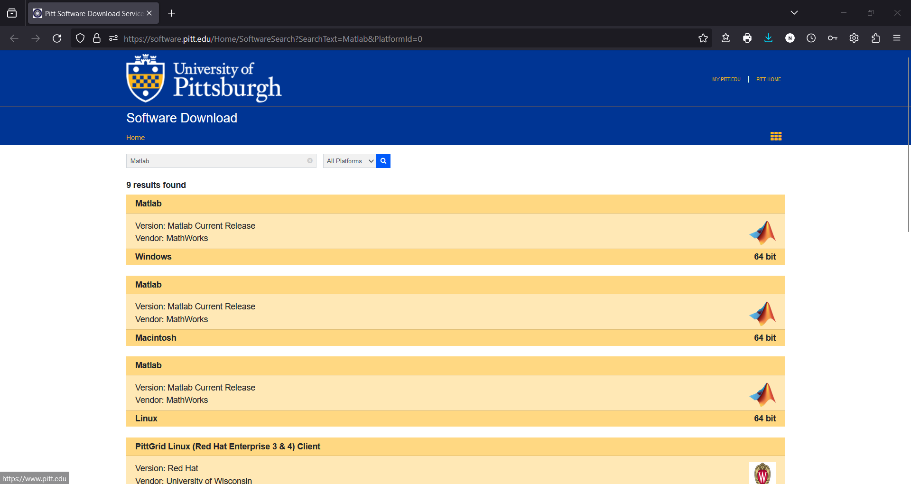
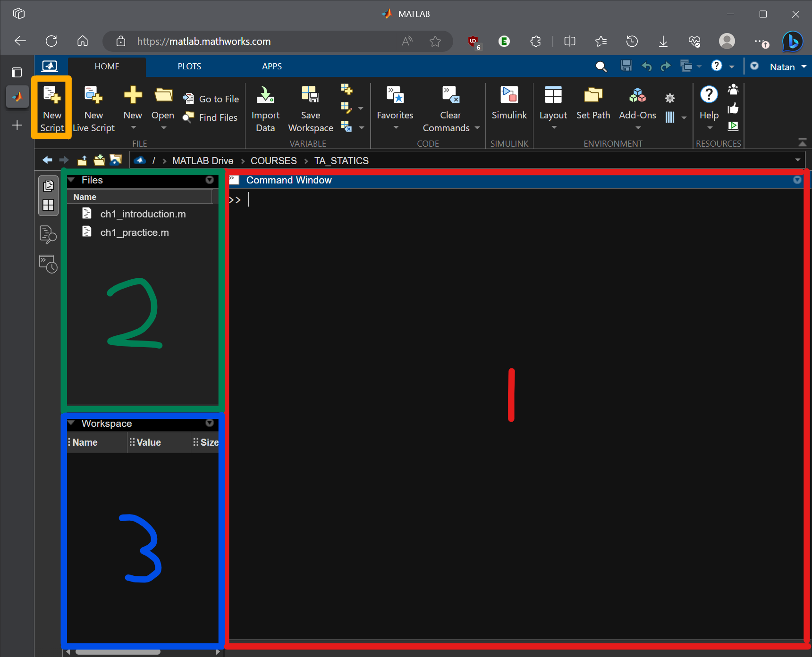
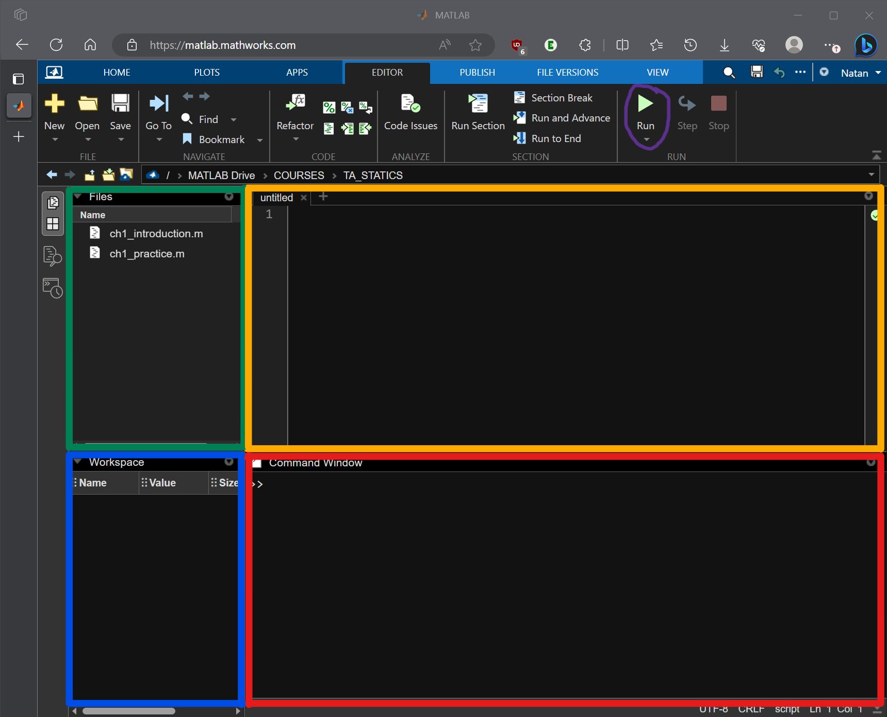

# Objectives

## Gain access to MATLAB

**There are two ways to access MATLAB**:
- Sign in to [MATLAB Online](https://www.mathworks.com/products/matlab-online.html) (recommended)
    - This is a web-based client that can run on any computer as long as you have internet access
    - Because it's hosted on Mathworks' own servers, it is up-to-date and reliable
    - We won't be doing anything intense enough to warrant the potential advantages of the desktop client
    - Files are stored in your MATLAB Drive, so they can be accessed anywhere
- Download the [Desktop Client](https://software.pitt.edu/Home/SoftwareSearch?SearchText=Matlab&PlatformId=0)
    - 
    - This link takes you to Pitt's Software Download Service, where it provides instructions for installation *be sure to click into the correct one for your computer (windows, mac, or linux)*
    - The desktop client is a pretty beefy application, so make sure you have enough storage
    - Unlike the web-based client, this will run on your local machine and will therefore use up some amount of processing power and memory while you're in MATLAB
    - You *can* install the MATLAB Drive onto your machine, but the desktop client will work from files on your local machine by default
    - I do not think any of you needs to install this, but if you want to use the desktop client instead of MATLAB Online, feel free. The content will not be different.

For the purposes of this course supplementary material, my instructions will correspond with working in MATLAB Online. If you are using the desktop client and have trouble finding buttons, I recommend that you take advantage of this wonderful thing called the internet. It's quite magical.

## Write a `Hello World` script

The MATLAB environment may be slightly intimidating if you are opening it for the first time, or if you just did not feel very comfortable with it during your previous courses. That's okay! We will be ignoring most of the buttons in the ribbon at the top and I'm going to quickly walk through the bigger sections underneath it.

There are 4 general sections that will matter to us, 1 of which is currently hidden and we will get to shortly. You can see `Command Window` (1), `Files` (2), and `Workspace` (3).

As you may imagine, the scripts that you write over time will show up in `Files`. `Workspace` houses any variables that get defined in your scripts. As you look through my examples, you can see that several things are listed there. And the `Command Window` is one place where you can write MATLAB code, but it is also the ouptut window for your scripts. We will be writing scripts.

So, let's click on the `New Script` button in the top left. This will create a blank, unnamed script. You can save (Ctrl + s) and name it. Your interface will look similar to the following:

You can see a new window has been created. This is where we can write some code (refer to example script: `ch1_example.m`). With this example, clicking the `Run` button, circled in purple in the ribbon at the top of the screen, will execute and print several statements to the `Command Window`. Be sure to read through the commented explanations for a thorough understanding of what each command does.

When you are comfortable with the example, take a look at the practice script: `ch1_practice.m`. Here, you are given an outline of some tasks to accomplish, but no code. I encourage you to work with friends and look things up on the internet to become familiar with anything you do not already know how to do. As the semester progresses, I will introduce more advanced topics and being comfortable with looking up your questions is a very important skill.