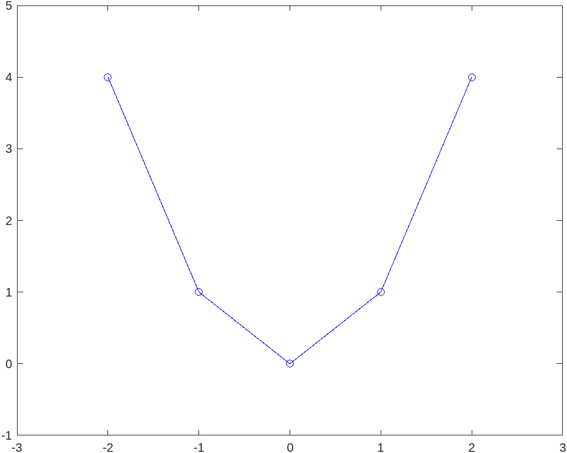
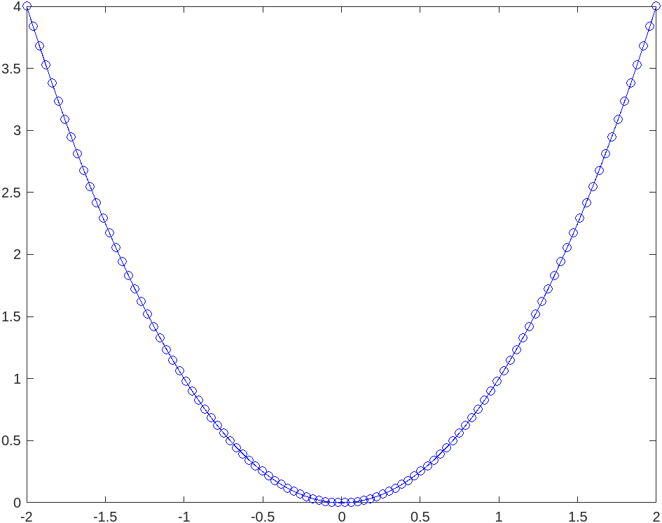

# Objectives

## Vectors in MATLAB

With pen and paper, we often write vectors as the following: $$\vec{v}=(a, \, b, \, c)$$ to represent the 3D spatial vector: $$\vec{v}= a\hat{i} + b\hat{j} + c\hat{k}$$

In MATLAB, we can do the same thing, but in the editor it is written as `v = [a,b,c]`. In MATLAB, vectors act as a way to store information and can be used for our usual 3D purposes, but can also be extended much further than that.

For example, if you wanted to obtain a plot of the equation $y=x^2$ on the interval $[-2,2]$, you can use vectors as follows:

```MATLAB
x = [-2, -1, 0, 1, 2]; % define the input points
y = x.^2; % apply the equation (notice the . before the ^, it is important)
plot(x,y) % graph
```



But as you can see, when you run that code, you don't really get a great graph. That's because the vector `x` only contains 5 input points and so does the output, `y`. I could type in more numbers by hand, but that is really tedious, so let's instead explore two methods for generating vectors automatically.

```MATLAB
x1 = linspace(0,10); % this generates a vector between 0-10 with 100 points
x2 = linspace(0,10,20); % this does the same, but uses only 20 points
```

The `linspace` command is very intuitive with its syntax as follows: `linspace(<start>, <end>, <number of poitns>)`, but you can leave the third argument empty and it will default to creating 100 evenly spaced points.

```MATLAB
x1 = [0:10]; % this generates a vector between 0-10 again, but spaced by 1
% output: x1 = [0, 1, 2, 3, 4, 5, 6, 7, 8, 9, 10]
x2 = [0:0.1:10]; % this time, points are spaced by 0.1 instead of by 1
```

This notation is slightly different from before. The colon notation with only two inputs is as follows: `<start>:<end>`. Whereas with three inputs: `<start>:<step size>:<end>`.

You can choose to use whichever operation makes more sense to you.

Now if we repeat what we did before, we can use a higher resolution input:

```MATLAB
x = linspace(-2,2); % define the input points
y = x.^2; % apply the equation
plot(x,y) % graph
```



Fantastic!

**Side Note**: There are some times when it is useful to define vectors in MATLAB vertically, rather than horizontally.

That looks as follows:
```MATLAB
a = [1;2;3];
```
**or**
```MATLAB
a = [1,2,3]';
```

will produce $$a = \begin{bmatrix}1 \\ 2 \\ 3 \end{bmatrix}$$

We will not be getting into the applications for this right now, but it is good to know of its existence.

Now that we are generally familiar with vectors, let's get back to the 3D use case. A vector $$\vec{v}= 4\hat{i} + 8\hat{j} + 3\hat{k}$$ can be written in MATLAB as follows: `v = [4, 8, 3]`. And the awesome part about MATLAB is that we can also perform operations on it, just like with vectors in pen and paper math.

## Vector Operations

The four operations we'll cover here are: addition, subtraction, scalar multiplication, and the dot product.

Let's start with addition and subtraction. Recall that when adding two vectors, for example: $$\vec{a}=1\hat{i} + 2\hat{j} + 3\hat{k}$$ $$\vec{b} = 3\hat{i} + 2\hat{j} + 1\hat{k}$$ we add each of the components separately: $$\vec{c} = (1+3)\hat{i} + (2 + 2)\hat{j} + (3 + 1)\hat{k} = 4\hat{i}+4\hat{j}+4\hat{k}$$

In MATLAB, we don't have to do this manually. Let's define the same two vectors in MATLAB:

```MATLAB
a = [1, 2, 3];
b = [3, 2, 1];
c = a + b
```
`output: c = [4, 4, 4]`

And subtracting two vectors is equally simple:

```MATLAB
a = [1, 2, 3];
b = [3, 2, 1];
c = a - b
```
`output: c = [-2, 0, 2]`

MATLAB handles the element-wise calculations for you! It is important to make sure that the vectors involved have the same dimensions. The following will not work:

```MATLAB
a = [1, 2, 3, 4];
b = [3, 2, 1];
c = a - b
```

`output: Arrays have incompatible sizes for this operation`

**NOTE**, be aware of the direction of your vectors. For these operations both `a` and `b` should be oriented the same way.

```MATLAB
a = [1, 2, 3]';
b = [3, 2, 1];
c = a - b;
```

In this case, `a` is transposed, while `b` remains as it was.

$$a = \begin{bmatrix}1 \\ 2 \\ 3 \end{bmatrix}$$
$$b = \begin{bmatrix}3, & 2, & 1 \end{bmatrix}$$

This time, the output of `c = a - b` is a matrix, which we haven't covered yet: 
$$c =
\begin{bmatrix}
-2 & -1 & 0 \\
-1 & 0 & 1 \\
0 & 1 & 2
\end{bmatrix}
$$

So make sure your vectors are oriented the same way!

Now that we've covered basic vector addition and subtraction, let's get into applying a scalar multiple to a vector.

In regular math, performing the following operation requires multiplying each element individually: $$ \vec{a} = \begin{bmatrix}1, & 2, & 3 \end{bmatrix} $$ $$\vec{b} = 3 \vec{a} = \begin{bmatrix}3, & 6, & 9 \end{bmatrix} $$

In MATLAB, 
```MATLAB
a = [1, 2, 3]
b = a.*3
```

returns $$ b = \begin{bmatrix}3, & 6, & 9 \end{bmatrix} $$

This operation multiplies every element in the vector `a` by 3 for you. Similarly, we can divide every element by 3 by simply applying $\frac{1}{3}$ as follows: `b = a.*(1/3)` returns $$ b = \begin{bmatrix}0.3333, & 0.6666, & 1 \end{bmatrix} $$

And finally, we can go over dot and cross products in MATLAB! Hopefully this is where you start to recognize how much easier your life can be.

When done by hand, a dot product entails multiplying corresponding components of the two vectors together and then taking the sum of all the multiples. For example:

$$\vec{a} = 3\hat{i} + 2\hat{j} + 1\hat{k}$$
$$\vec{b} = 5\hat{i} + 4\hat{j} + 3\hat{k}$$
$$\vec{a}\cdot\vec{b} = (3)(5) + (2)(4) + (1)(3) = 26$$

In MATLAB, we just have a built-in function to perform the exact same operation! The `dot()` command takes two vectors of the same size as inputs and will return the operation detailed above.

```MATLAB
a = [3, 2, 1];
b = [5, 4, 3];
dot(a, b)
```

`output: ans = 26`

In this class, and in many others after, it is common to take the dot product between two vectors. While you can choose to do this by hand, you are more likely to make mistakes and it will take significantly longer than doing it in MATLAB. Especially when the dot product is only one piece of a much larger calculation.

## Unit Vectors

In engineering, we often need to know directions for various things. For example, the direction along which a force is acting, or the direction in which an object is moving. These are best reported as "unit vectors," which have a magnitude $\Vert \vec{u} \Vert=1$. In general, these vectors can be referred to as having been "normalized".

Normalizing a vector involves two steps:
1. Calculate the magnitude of the vector
    - Recall for $\vec{v}=\begin{bmatrix}a,&b,&c\end{bmatrix}$
    - $\Vert\vec{v}\Vert=\sqrt{a^2+b^2+c^2}$
2. Divide each component of the vector by the magnitude
    - $\hat{u} = \begin{bmatrix}\frac{a}{\Vert\vec{v}\Vert},&\frac{b}{\Vert\vec{v}\Vert},&\frac{c}{\Vert\vec{v}\Vert}\end{bmatrix}$

Performing this calculation by hand can be tedious, especially when you have to normalize multiple vectors. However, it is incredibly simple in MATLAB:

```MATLAB
a = [1, 2, 3]; % define vector, a
magnitude = norm(a); % calculate the magnitude of a
normalized = a./magnitude % divide each component by the magnitude
```

`output: normalized = [0.2673, 0.5345, 0.8018]`

In this example, the command `norm(<input vector>)` calculates the magnitude of the input vector for you!

So now, if we have a force that is described by the vector:

$$\vec{F} = \begin{bmatrix} 17, & 12, & 35 \end{bmatrix} [\mathrm{N}] $$

we can use the `norm()` command to get a better understanding of what this information actually means in the real world.

Recall our steps:

1. Determine $\Vert\vec{F}\Vert$
2. Calculate the unit (direction) vector, $\hat{u}$
3. Rewrite $\vec{F}$ to have a more useful physical interpretation

```MATLAB
F = [17, 12, 35];
magnitude = norm(F)
direction = F./magnitude
```

`output: magnitude = 40.7185 and direction = [0.4175, 0.2947, 0.8596]`

Thus, we can reinterpret $\vec{F}$ as follows:

$\vec{F}$ is a force of $40.7185 \, [\mathrm{N}]$ acting along the direction $\hat{u} = \begin{bmatrix} 0.4175, & 0.2947, & 0.8596 \end{bmatrix}$

$\vec{F} = \left(40.7185 \, [\mathrm{N}]\right)\hat{u}$

## Vectorized Operations

In some of the previous notes, you will have hopefully seen that I occasionally put a `.` before an operation. From the example above: `direction = F./magnitude`. This denotes a "vectorized" operation, which means that the operation (dividing by `magnitude`, in this example) is applied to every element of the vector (`F`, in this example) individually.

So, `F./magnitude` is really performing the following operation: 

$$
\begin{bmatrix}
\frac{F_x}{\Vert\vec{F}\Vert}, & \frac{F_y}{\Vert\vec{F}\Vert}, & \frac{F_z}{\Vert\vec{F}\Vert}
\end{bmatrix}
$$

**Why does this matter?**

This functionality allows you act on entire vectors at the same time, which saves you from either manually writing each individual operation or using some other, longer technique to accomplish the same thing.

We will continue using this in the future.

## Trig in MATLAB

Trigonometry in MATLAB is basically the same as it would be in your calculator. But there is a very important distinction between using degrees and radians.

`sin(pi/2) = 1`

`sind(90) = 1`

For every trigonometric function, the name includes a `d` at the end to signify that the input is taken in degrees. Otherwise, the input is radians. This rule applies to inverse trigonometric functions as well.

`asin(1) = pi/2`

`asind(1) = 90`

In our course right now, this is relevant for determining the angle between two vectors. The formula for this calculation is as follows:

$$ \cos{\theta} = \frac{\vec{a} \cdot \vec{b} }{\Vert\vec{a}\Vert\Vert\vec{b}\Vert} $$

which transforms into:

$$ \theta = \arccos{\frac{\vec{a} \cdot \vec{b} }{\Vert\vec{a}\Vert\Vert\vec{b}\Vert}} $$

In MATLAB:

```MATLAB
a = [1, 2, 3]; % define vector a
b = [3, 2, 1]; % define vector b

% calculate the numerator and denominator in the formula
numerator = dot(a,b);
denominator = norm(a) * norm(b);

% calculate the angle in radians and degrees
thetaRadians = acos(numerator / denominator) % radians
thetaDegrees = acosd(numerator / denominator) % degrees
```

`output: thetaRadians = 0.7752 and thetaDegrees = 44.4153`

That's it for vectors! We will continue to work with vectors throughout the semester, but you now have enough tools to do fairly complex calculations for this course. Check out the example and practice scripts: `ch2_example.m` and `ch2_practice.m` for some MATLAB scripts that you can play around with.