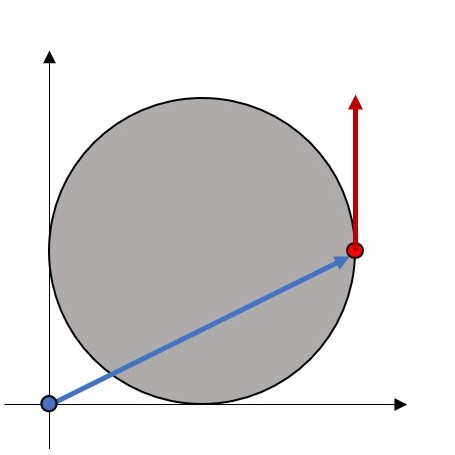
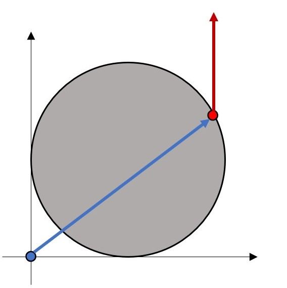
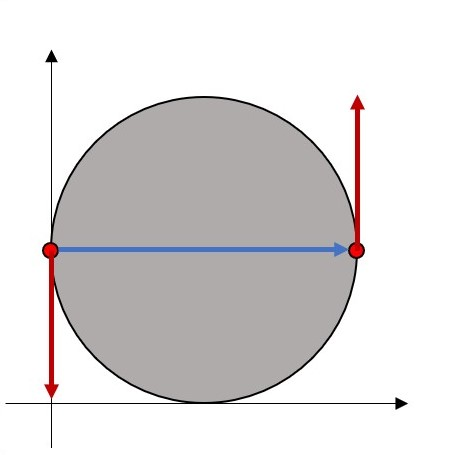
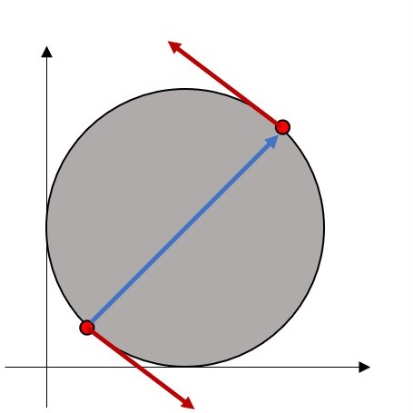

# Chapter 3

## Vector Projection

In the last chapter, we introduced the dot product. One of its most powerful uses is for decomposing vectors into their projections along specific directions.

For example, when considering the moment acting on a car's wheel, we may be particularly interested in the component that acts along the direction of the axle, as that determines its tendency to rotate.

Or when considering the force on an airplane wing in flight, we may want to decompose it into components that lie parallel and perpendicular to the wing itself.

As we learned in class, the formula for the projection of $\vec{a}$ along the direction of $\vec{b}$ (let's call it $\vec{p}_{a/b}$) is as follows:

$$\vec{p}_{a/b} = \left(\vec{a}\cdot\hat{e}_b\right)\hat{e}_b$$

And recall that $\hat{e}_b$ is the unit direction vector along $\vec{b}$, which can be calculated as follows:

$$\hat{e}_b = \frac{\vec{b}}{\Vert\vec{b}\Vert}$$

When done by hand, this can be very tedious:

$$\Vert\vec{b}\Vert = \sqrt{(b_x)^2 + (b_y)^2 + (b_z)^2}$$

$$\vec{p}_{a/b} = \left(\begin{bmatrix}a_x & a_y & a_z\end{bmatrix} \cdot \frac{1}{\Vert\vec{b}\Vert}\begin{bmatrix}b_x \\ b_y \\ b_z \end{bmatrix}\right)\left(\frac{1}{\Vert\vec{b}\Vert}\begin{bmatrix}b_x \\ b_y \\ b_z \end{bmatrix}\right)$$

$$\vec{p}_{a/b} = \left(\frac{(a_x)(b_x) + (a_y)(b_y) + (a_z)(b_z)}{\Vert\vec{b}\Vert^2}\right) \begin{bmatrix}b_x \\ b_y \\ b_z \end{bmatrix}$$

I'm pretty sure we can agree that neither of us wants to do all that work ourselves

If you take advantage of MATLAB, it simplifies the work greatly:

```MATLAB
a = [1, 1, 1]; % define vector a
b = [1, 0, 0]; % define vector b
normB = norm(b); % calculate the magnitude of b
e_b = b./normB; % get the unit direction vector for b
proj = e_b.*(dot(a, e_b)); % perform the projection of a onto b
```

`output: proj = [1, 0, 0]`

Or, you can put the entire projection formula into a single line, as follows:

```MATLAB
a = [1, 1, 1]; % define vector a
b = [1, 0, 0]; % define vector b
proj = (b./norm(b)) .* (dot(a, b./norm(b)));
```

`output: proj = [1, 0, 0]`

As you can see, MATLAB gives you the power to do complex math with very little work. It's an extremely powerful tool!

## Vector Cross Product

Like the dot product, the cross product is extremely common, especially in this course. A common example is considering the moment created by a force $\vec{F}$ acting at a distance $\vec{r}$. We calculate $\vec{M} = \vec{r} \times \vec{F}$.

When performed by hand, we have to go through the tedious process of calculating the $3 \times 3$ determinant:

$$
\vec{M} =
% det\left(
\begin{bmatrix}
\hat{i} & \hat{j} & \hat{k} \\
r_x & r_y & r_z \\
F_x & F_y & F_z
\end{bmatrix}
% \right)
$$

$$\vec{M} = \left(r_yF_z - r_zF_y\right)\hat{i} - \left(r_xF_z - r_zF_x\right)\hat{j} + \left(r_xF_y - r_yF_x\right)\hat{k}$$

That's quite a process! In MATLAB, just like with `dot()`, there is a `cross()` function to make our lives easy and awesome.

```MATLAB
a = [3, 2, 1];
b = [5, 4, 3];
cross(a, b)
```

`output: ans = [2, -4, 2]`

This is a **SUPER** important tool for this class. For a body to be in static equilibrium, it must not have any translational acceleration **and** it must not have any rotational acceleration. Therefore, $\Sigma\vec{F}=\vec{0},\,\mathrm{and}\,\Sigma\vec{M}_o=\vec{0}$

*Foreshadowing: One important example of this, which we will explore throughout the term, is the modeling of bridges. It goes without saying that a bridge should not suddenly start translating or rotating in any way. This would be bad*

This is the reason that we are building these skills now.

## Moments vs. Couples

In class, we have talked about both moments and couples and some of their differences. I want to briefly motivate why we treat them as separate things, given that their formulas are very similar.

A moment, calculated with $\vec{r} \times \vec{F}$, represents a tendency to rotate *about the origin of the vector $\vec{r}$*. Because $\vec{r}$ is defined from a specific point, the moment, $\vec{M}$, is tied to that location. If you applied $\vec{F}$ at a different spot on the body, its behavior would change.

In contrast, a couple (also calculated as $\vec{r}\times\vec{F}$) represents a tendency to rotate *in general*. Because $\vec{r}$ is the vector between the two participatory forces and not from somewhere else on the body, the couple, $\vec{C}$, is not tied to any particular spot. You could choose to apply the force couple at a different location on the body and you would see the exact same rotation.

And as my friend Shane puts it, "a couple is location-independent because it will never cause translation".

Let's quickly visualize this!

<p float="left">
  
  
</p>

Here we have the same force applied at two different locations. Without even doing math, we can see visually that the blue $\vec{r}$ is different and its angle with the red $\vec{F}$ is also different. Therefore, we reason that these two $\vec{M}_o$ are different.

<p float="left">
  
  
</p>

Here we have the same couple applied at two different locations. This time, it is visually clear that these two couples are just rotated versions of each other. And because the blue $\vec{r}$ and the red $\vec{F}$ are still oriented the same way relative to each other, the resultant couple, $\vec{C}$, is identical!
