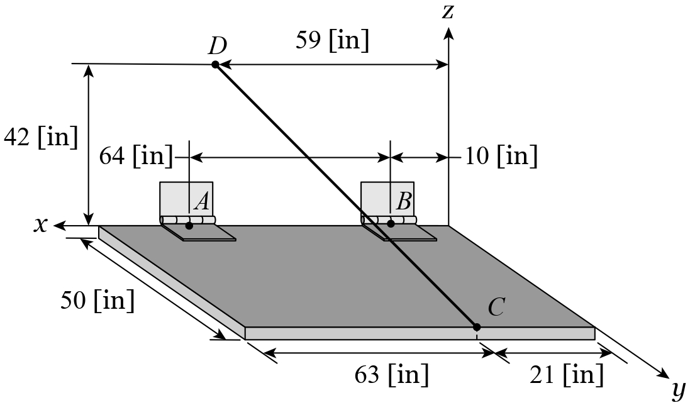
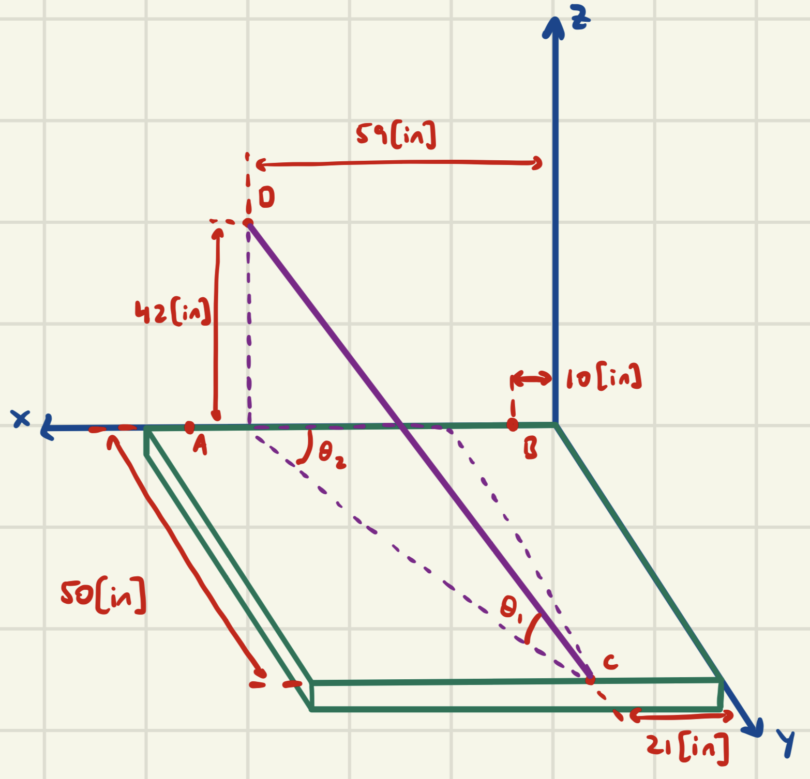
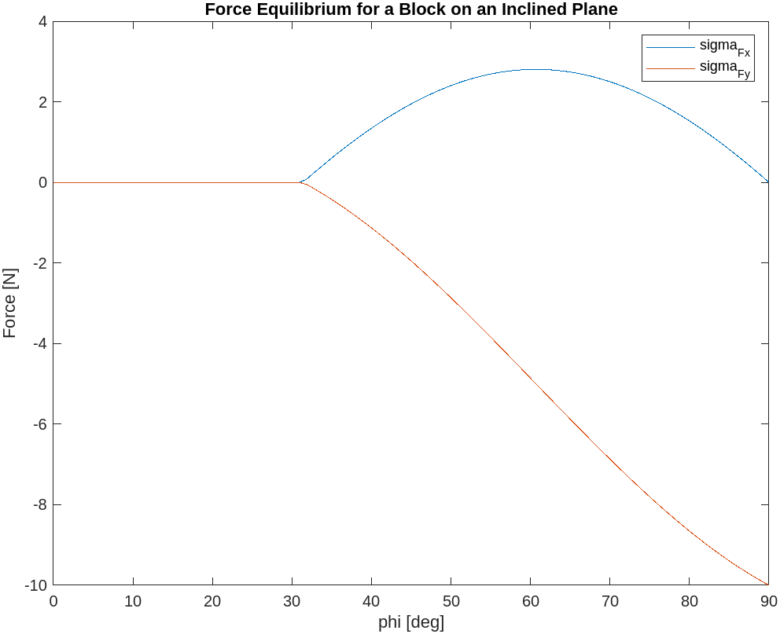

# Chapter 5

I expect that by this point in your academic career, you have already seen systems of equations and are familiar with a couple of methods for solving them, like direct substitution:

$$
\begin{Bmatrix}
x + y = 10 \\
\displaystyle
\frac{1}{2}x - y = -3
\end{Bmatrix}
$$

Rearranging the first equation yields:

$$
y = 10 - x
$$

Substituting this into the second equation yields:

$$
\displaystyle
\frac{1}{2}x - \left(10 - x \right) = -3
$$

Solving this for $x$ yields:

$$
x = \frac{2}{3}7 = \frac{14}{3}
$$

Then go back and solve for $y$:

$$
y = 10 - \frac{14}{3} = \frac{16}{3}
$$

Hopefully this was not new for you. This chapter will introduce two new methods for solving systems of equations that are significantly simpler for you.

## Systems of Eqations - Matrix Form

We can rewrite the system of equations above using linear algebra as follows:

$$
\begin{bmatrix}
1 & 1 \\
\displaystyle
\frac{1}{2} & -1
\end{bmatrix}
\begin{Bmatrix}
x \\
y
\end{Bmatrix} =
\begin{Bmatrix}
10 \\
-3
\end{Bmatrix}
$$

Perhaps this was intimidating, so let me break down what I've done. The matrix here is called a *coefficient matrix* because it contains the coefficients for the variables $x,y$ in the original equations.

If you look, the first row of the matrix matches the first equation:

$$
\begin{bmatrix}
1 & 1
\end{bmatrix}
\begin{Bmatrix}
x \\
y
\end{Bmatrix} =
x + y
$$

And similarly, the second row of the matrix matches the second equation:

$$
\begin{bmatrix}
\displaystyle
\frac{1}{2} & -1
\end{bmatrix}
\begin{Bmatrix}
x \\
y
\end{Bmatrix} =
\frac{1}{2}x - y
$$

And the vector on the right-hand side of the matrix equation just contains the right-hand sides of both of the equations from above.

As an example, I'm going to take $\mathrm{P}.5.70$ from Homework $6$ and solve it the hard way by brute force.



First, list the sum of forces in each direction:

$$
\displaystyle
\sum F_{x} = 0 \Rightarrow R_{A,x} + T_{\overline{CD},x} = 0
$$

$$
\displaystyle
\sum F_{y} = 0 \Rightarrow R_{A,y} + R_{B,y} - T_{\overline{CD},y} = 0
$$

$$
\displaystyle
\sum F_{z} = 0 \Rightarrow R_{A,z} + R_{B,z} + T_{\overline{CD},z} - W = 0
$$

So far, there are $6$ variables: $R_{A,x},R_{A,y},R_{A,z},R_{B,y},R_{B,z},T_{\overline{CD}}$.

Note that $T_{\overline{CD}}$ is decomposed into its components by trigonometry as follows:



$$
L_{\overline{CD}} = \sqrt{(59-21)^2 + 50^2 + 42^2} = 75.5513\left[\mathrm{in}\right]
$$

$$
\theta_{1} = \sin^{-1}\left(\frac{42}{L_{\overline{CD}}}\right)
$$

$$
\theta_{2} = \tan^{-1}\left(\frac{50}{38}\right)
$$

Which then leads to the following:

$$
T_{\overline{CD},x} = T_{\overline{CD}}\cos\left(\theta_{1}\right)\cos\left(\theta_{2}\right)
$$

$$
T_{\overline{CD},y} = T_{\overline{CD}}\cos\left(\theta_{1}\right)\sin\left(\theta_{2}\right)
$$

$$
T_{\overline{CD},z} = T_{\overline{CD}}\sin\left(\theta_{1}\right)
$$

So far, we only have $3$ equations and $6$ variables. So let's write out equations for the moments in each axial direction at point $\mathrm{C}$ to avoid introducing the reactionary moments at $A$ or $B$.

$$
\displaystyle
\circlearrowleft \sum M_{C,x} = 0 \Rightarrow
-(R_{A,z})(50) - (R_{B,z})(50) + (W)(25) = 0
$$

$$
\displaystyle
\circlearrowleft \sum M_{C,y} = 0 \Rightarrow
-(R_{A,z})(74-21) + (R_{B,z})(21-10) + (W)\left(\frac{84}{2} - 21\right) = 0
$$

$$
\displaystyle
\circlearrowleft \sum M_{C,z} = 0 \Rightarrow
(R_{A,x})(50) + ((R_{A,y}))(74-21) - (R_{B,y})(21-10) = 0
$$

This leaves us with six equations:

$$
\begin{Bmatrix}
R_{A,x} + T_{\overline{CD}}\cos\left(\theta_{1}\right)\cos\left(\theta_{2}\right) = 0 \\
R_{A,y} + R_{B,y} - T_{\overline{CD}}\cos\left(\theta_{1}\right)\sin\left(\theta_{2}\right) = 0 \\
R_{A,z} + R_{B,z} + T_{\overline{CD}}\sin\left(\theta_{1}\right) = W \\
-(R_{A,z})(50) - (R_{B,z})(50) = -(W)(25) \\
-(R_{A,z})(74-21) + (R_{B,z})(21-10) = -(W)\left(\frac{84}{2} - 21\right) \\
(R_{A,x})(50) + ((R_{A,y}))(74-21) - (R_{B,y})(21-10) = 0
\end{Bmatrix}
$$

That's kind of gross, but now we can write this as a matrix! Keep in mind that each row of the matrix contains a coefficient for every variable. And if an equation does not contain a variable, its coefficient is $0$.

$$
\begin{bmatrix}
1 & 0 & 0 & 0 & 0 & \cos\left(\theta_{1}\right)\cos\left(\theta_{2}\right) \\
0 & 1 & 0 & 1 & 0 & \cos\left(\theta_{1}\right)\sin\left(\theta_{2}\right) \\
0 & 0 & 1 & 0 & 1 & \sin\left(\theta_{1}\right) \\
0 & 0 & -50 & 0 & -50 & 0 \\
0 & 0 & -53 & 0 & 11 & 0 \\
50 & 53 & 0 & -11 & 0 & 0
\end{bmatrix}
\begin{Bmatrix}
R_{A,x} \\
R_{A,y} \\
R_{A,z} \\
R_{B,y} \\
R_{B,z} \\
T_{\overline{CD}}
\end{Bmatrix} =
\begin{Bmatrix}
0 \\
0 \\
W \\
-25W \\
-21W \\
0
\end{Bmatrix}
$$

Now, all we have to do is invert the matrix to isolate our variable vector. Let's quickly use MATLAB to do this.

```MATLAB
L_cd = norm([(59-21), 50, 42]);
theta_1 = asin(42/L_cd);
theta_2 = atan(50/(59-21));

% bit matrix equation
M = [1, 0, 0, 0, 0, cos(theta_1)*cos(theta_2);...
     0, 1, 0, 1, 0, -cos(theta_1)*sin(theta_2);...
     0, 0, 1, 0, 1, sin(theta_1);...
     0, 0, -50, 0, -50, 0;...
     0, 0, -53, 0, 11, 0;...
     50, 53, 0, -11, 0, 0];

W = 240;
b = [0; 0; W; -25*W; -21*W; 0];

v = inv(M)*b
```

Output:

$$
\begin{Bmatrix}
R_{A,x} \\
R_{A,y} \\
R_{A,z} \\
R_{B,y} \\
R_{B,z} \\
T_{\overline{CD}}
\end{Bmatrix} =
\begin{Bmatrix}
-108.5714\left[\mathrm{lb_{f}}\right] \\
109.3750\left[\mathrm{lb_{f}}\right] \\
99.3750\left[\mathrm{lb_{f}}\right] \\
33.4821\left[\mathrm{lb_{f}}\right] \\
20.6250\left[\mathrm{lb_{f}}\right] \\
215.8609\left[\mathrm{lb_{f}}\right]
\end{Bmatrix}
$$

That was quite a bit of work and it was mostly unnecessary because the equation for $\displaystyle \circlearrowleft \sum M_{A,x} = 0$ would be enough to solve the problem.

But this is a robust example that demonstrates the power of matrix solution for a system of equations.

## Systems of Equations - Symbolic Toolbox

There is an even easier method for solving a system of equations, which makes use of the `Symbolic Toolbox` we saw in the previous chapter. Here, we can define symbolic variables and equations and utilize the `solve()` command.

Going back to our first example:

$$
\begin{Bmatrix}
x + y = 10 \\
\displaystyle
\frac{1}{2}x - y = -3
\end{Bmatrix}
$$

This can be written in MATLAB utilizing the `Symbolic Toolbox` as follows:

```MATLAB
syms x y
eqn1 = x + y == 10;
eqn2 = (1/2)*x - y == -3;
```

We then declare a list of equations and a list of variables, as follows:

```MATLAB
eqns = [eqn1, eqn2];
vars = [x, y];
```

To solve, we use the `solve()` command, which takes these two lists as its inputs, as follows:

```MATLAB
solve(eqns, vars)
```

This outputs the following structure:

```MATLAB
x: 14/3
y: 16/3
```

Likewise, we can solve the complex problem from the homework symbolically. Let's step through that process.

I've already gone through the pain and suffering of writing the equations, so we can just input those right into MATLAB, specifying our variables. And I will copy our definitions of $\theta_1$ and $\theta_2$ from earlier.

```MATLAB
L_cd = norm([(59-21), 50, 42]);                           % get length of CD
theta_1 = asin(42/L_cd);                                  % define theta_1
theta_2 = atan(50/38);                                    % define theta_2

W = 240;                                                  % define weight

syms Rax Ray Raz Rby Rbz Tcd                              % declare variables
sigma_F_x = Rax + Tcd*cos(theta_1)*cos(theta_2) == 0;
sigma_F_y = Ray + Rby - Tcd*cos(theta_1)*sin(theta_2) == 0;
sigma_F_z = Raz + Rbz + Tcd*sin(theta_1) - W == 0;
sigma_M_cx = -Raz*50 - Rbz*50 + W*25 == 0;
sigma_M_cy = -Raz*(74-21) + Rbz*(21-10) + W*(84/2-21) == 0;
sigma_M_cz = Rax*50 + Ray*(74-21) - Rby*(21-10) == 0;

eqns = [sigma_F_x, sigma_F_y, sigma_F_z, sigma_M_cx, sigma_M_cy, sigma_M_cz];
vars = [Rax Ray Raz Rby Rbz Tcd];

soln = solve(eqns, vars);

Rax = double(soln.Rax)
Ray = double(soln.Ray)
Raz = double(soln.Raz)
Rby = double(soln.Rby)
Rbz = double(soln.Rbz)
Tcd = double(soln.Tcd)
```

The output is exactly the same as before!

$$
\begin{Bmatrix}
R_{A,x} \\
R_{A,y} \\
R_{A,z} \\
R_{B,y} \\
R_{B,z} \\
T_{\overline{CD}}
\end{Bmatrix} =
\begin{Bmatrix}
-108.5714\left[\mathrm{lb_{f}}\right] \\
109.3750\left[\mathrm{lb_{f}}\right] \\
99.3750\left[\mathrm{lb_{f}}\right] \\
33.4821\left[\mathrm{lb_{f}}\right] \\
20.6250\left[\mathrm{lb_{f}}\right] \\
215.8609\left[\mathrm{lb_{f}}\right]
\end{Bmatrix}
$$

This solution is super simple and very, very powerful for solving large systems of equations. When we start working on bridges there will easily be more than $10$ equations. Doing that by hand will be infeasible and I highly recommend practicing applying this in `ch5_practice.m` after taking a look through all the centralized MATLAB code in `ch5_example.m`

## Looping

To introduce loops, I want to work through the conceptual problem posed in the textbook under Section $5.4$ Friction. The premise is that a block sits on a surface, which is slowly lifted at an angle off the ground. For a while the block stays stationary until the angle becomes steep enough that the block starts to slide down. This should be relatively physically intuitive to you.

We can determine the maximum angle at which the block will remain stationary by performing this "lifting" action using a loop. We will incrementally increase the angle $\phi$ until the block begins to slide.

For this setup, there are three forces present: the block's weight, $W$; the normal force, $F_{N}$; and the friction force, $F_{f}$. For this problem let's define $\mu_{s}=0.61,\mu_{k}=0.47$ corresponding to the Aluminum and Steel (dry) combination from the textbook.

Now, since we're going to change the value of $\phi$, we have to write each of the forces in a generalized form as functions of $\phi$.

The block's weight will always act downwards, in the $-\hat{\jmath}$ directions. But $F_{N}$ and $F_{f}$ will have components in both the $\hat{\imath}$ and $\hat{\jmath}$ directions, as follows:

$$
\overrightarrow{W} = 0\hat{\imath} - 10\hat{\jmath}
$$

$$
\overrightarrow{F}_{N} = \left(\Vert\overrightarrow{W}\Vert\cos(\phi)\right)\left(\sin(\phi)\hat{\imath} + \cos(\phi)\hat{\jmath}\right)
$$

$$
\overrightarrow{F}_f = \left( \mu_s \Vert \overrightarrow{F}_N \Vert \right) \left( -\cos(\phi) \hat{\imath} + \sin(\phi) \hat{\jmath} \right)
$$

But remember that the magnitude of static friction force is only ever as high as it needs to be to oppose the other forces. This means that as long as the forces acting along the inclined plane are not equal to the maximum possible static friction force, the value of $F_{f}$ will not be equal to the equation shown above.

For this problem, if we use the forms above and find $\sum F_{x} < 0$, then we know that the force of friction is not actually as high as we calculated. We adjust its magnitude in the $x$ and $y$ directions to directly oppose the sum of $\overrightarrow{W} + \overrightarrow{F}_{N}$, as follows:

$$
\overrightarrow{F}_f = -F_{N,x}\hat{\imath} + \left(-W_y - F_{N,y}\right)\hat{\jmath}
$$

Armed with these equations, we can write a loop to analyze the system in MATLAB:

```MATLAB
clear all
close all
clc

mu_s = 0.61;  % set the coefficient of static friction

phi = linspace(0,90,100);   % define a vector for phi to loop over

SLIPPED = false;    % initiate SLIPPED variable to track whether the block has slipped

for i=1:length(phi)
  % define the generalized vectors for each force
  W = [0, -10];
  F_N = norm(W)*cosd(phi(i))*[sind(phi(i)), cosd(phi(i))];
  F_f = mu_s*norm(F_N)*[-cosd(phi(i)), sind(phi(i))]; % we will come back to this

  % evaluate sum of forces in x-direction
  sigma_F_x(i) = W(1) + F_N(1) + F_f(1);

  if sigma_F_x(i) > 0 && SLIPPED == false
    SLIPPED = true;   % track that the block has slipped
    max_angle = phi(i);   % store the maximum angle
  elseif SLIPPED == false
    % F_f as defined above represents the *maximum* possible force with which it can resist motion.
    % the actual magnitude of F_f is only as high as is necessary to resist the forces present
    F_f(1) = -F_N(1);   % reset the values back down to match the actual applied loads
    F_f(2) = -(W(2) + F_N(2));
  end

  % recalculate the net forces in x and y
  sigma_F_x(i) = W(1) + F_N(1) + F_f(1);
  sigma_F_y(i) = W(2) + F_N(2) + F_f(2);
end

fprintf('\nThe maximum angle at which the block remains stationary is %0.2f degrees\n', max_angle)

figure(1)
plot(phi, sigma_F_x);
hold on
plot(phi, sigma_F_y);
xlim([0,90])
xlabel('phi [deg]')
ylabel('Force [N]')
title('Force Equilibrium for a Block on an Inclined Plane')
legend('sigma_F_x', 'sigma_F_y')
hold off
```

`The maximum angle at which the block remains stationary is 31.82 degrees`



This work-through is certainly a bit advanced, but I am confident that you can work through what is happening step-by-step. If you are confused, read through `ch5_example.m` to get a more basic introduction to looping and then come back for another go at this again.
