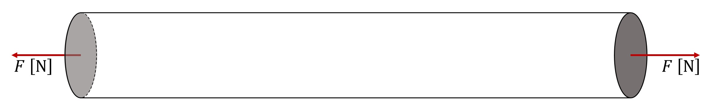
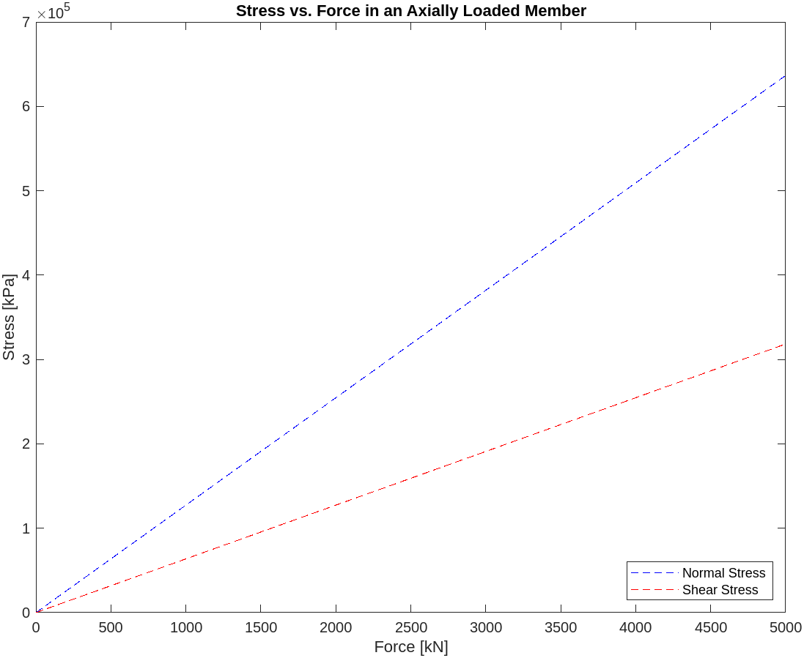
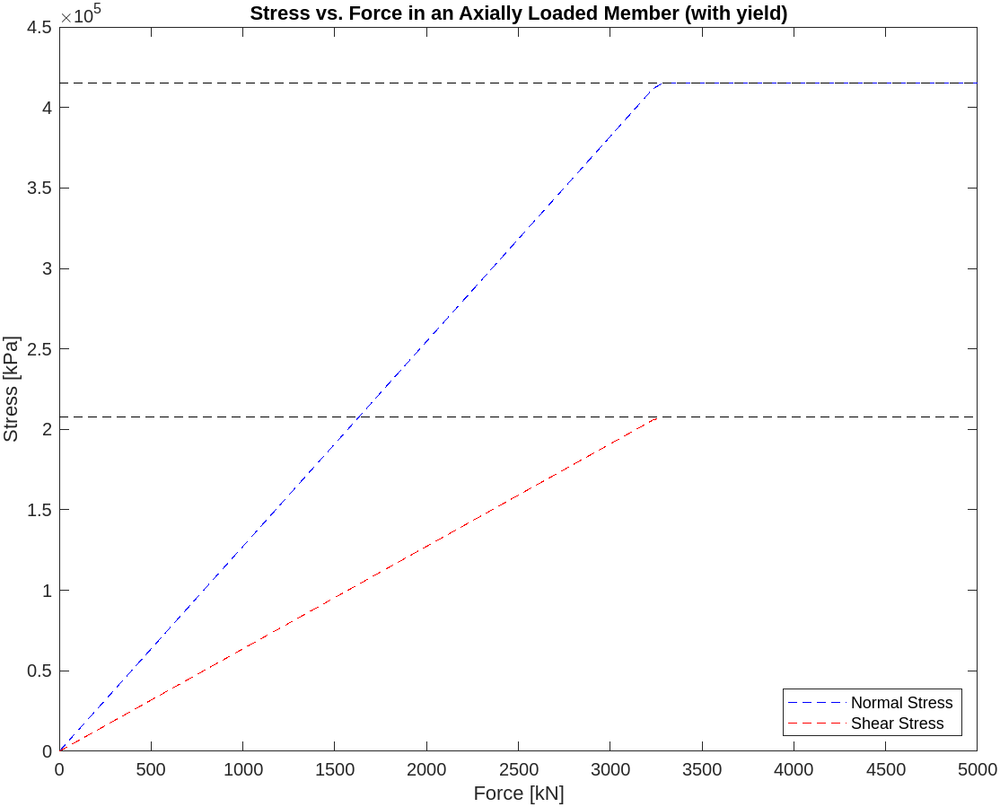
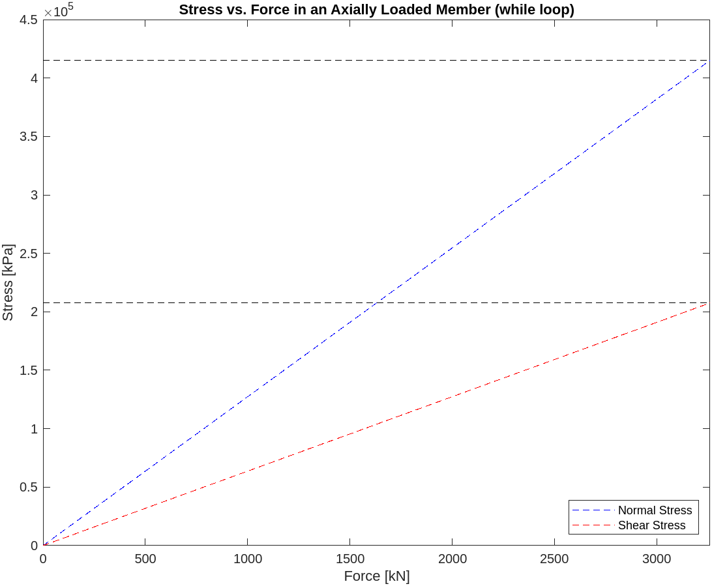
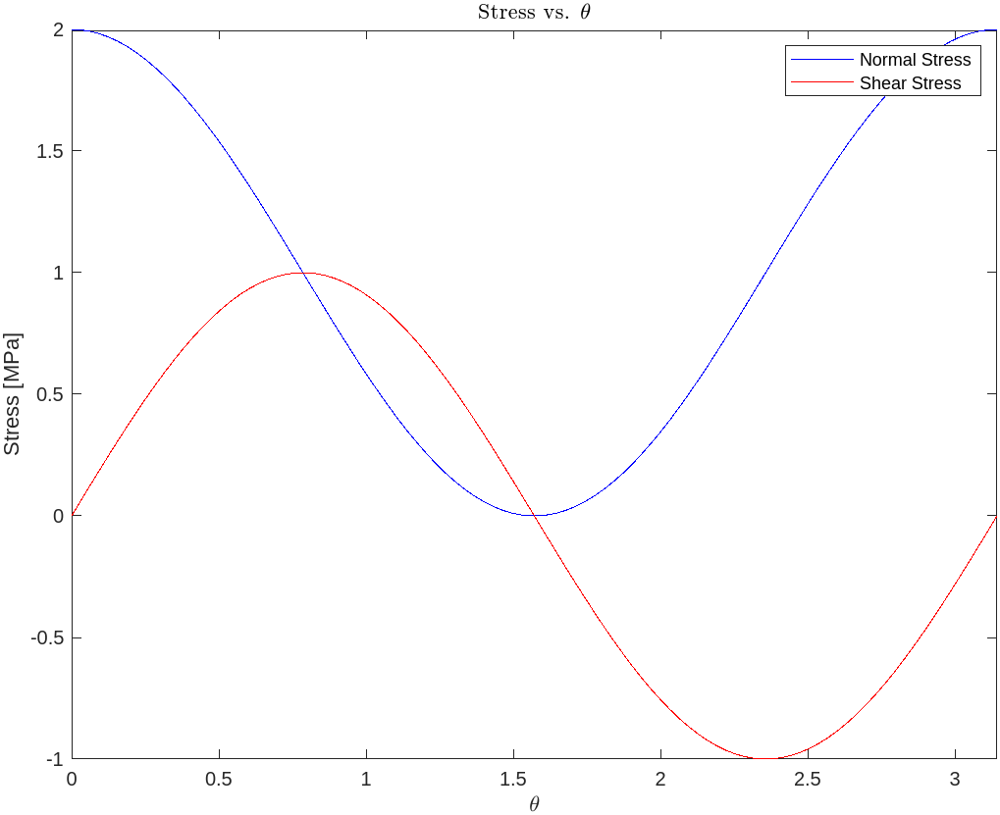
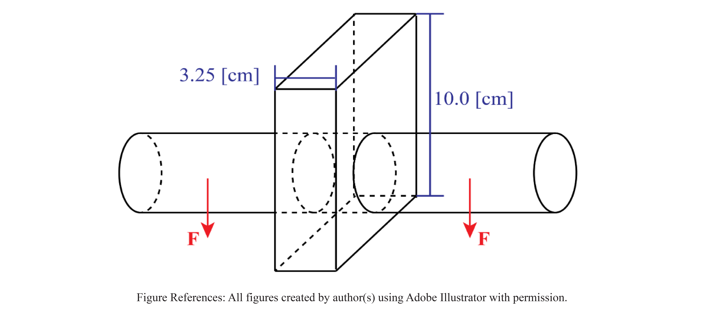

# Chapter 6

## Conditional Statements (Stress Limits)

When evaluating the stress in a loaded body, it is important to consider the yield conditions, $\sigma_{y}$ and $\tau_{y}$. These two conditions set upper limits on the different types of stress, beyond which the body is considered to have failed. Remember that as engineers, safety is one of our primary concerns, so we define "failure" as having reached a yield condition, even though that is not necessarily the point at which the body will fracture.

When evaluating the performance of a part, it is useful to perform a quick analysis of how much force it can undergo in a given loading configuration. This is tedious to do by hand because it would require manually doing the math over and over again with different force values. But in MATLAB, it is very simple.

Let's evaluate the maximum average normal and shear stresses present in an axially loaded cylindrical member of radius $r=5[\mathrm{cm}]$ as a function of the applied load $F$. Recall from the textbook that average normal stress, $\sigma_{avg}$, is maximized on the mutually orthogonal plane, but that average shear stress, $\tau_{avg}$ is maximized on a plane tilted $\theta=45^{\circ}$ from the vertical axis.



First, recognize that the basic premise of this analysis is a loop; we want to incrementally increase the force $F$ and analyze the stresses. That is a perfect problem for a loop! Let's set that up using a `for` loop like we did in the last chapter.

```MATLAB
clear all
close all
clc

% ----- GENERAL PARAMETERS ----- %
PLANE_ANGLE = 45; % [deg] angle of the plane of maximum average shear stress
CYL_RADIUS = 0.05; % [m]
  % solve for
  area_N = pi*CYL_RADIUS^2; % [m^2] area of the mutually orthogonal cross-section
  area_T = area_N/cosd(PLANE_ANGLE); % [m^2] area of the shear cross-section
INITIAL_LOAD = 0; % [kN]
FINAL_LOAD = 100; % [kN]
NUM_LOADS = 100;

% ----- INITIALIZE VECTORS ----- %
F = linspace(INITIAL_LOAD, FINAL_LOAD, NUM_LOADS); % [kN]
sigma = zeros(1, NUM_LOADS); % to store normal stress values
tau = zeros(1, NUM_LOADS); % to store shear stress values

% ----- LOOP OVER LOADS ----- %
for i = 1 : NUM_LOADS
  load = F(i); % [kN]
  sigma(i) = load / area_N; % [kPa]
  tau(i) = load*sind(PLANE_ANGLE) / area_T; % [kPa]
end

figure(1)
plot(F, sigma, 'b--')
hold on
plot(F, tau, 'r--')
hold off
xlabel('Force [kN]')
ylabel('Stress [kPa]')
title('Stress vs. Force in an Axially Loaded Member')
legend('Normal Stress', 'Shear Stress')
```



As we expect, both are linear functions and the normal stress $\sigma_{avg}$ is twice the shear stress $\tau_{avg}$.

However, we cannot just simple increase the force $F$ indefinitely because there are yield limits $\sigma_{y}$ and $\tau_{y}$. If either $\sigma_{avg} \geq \sigma_{y}$ or $\tau_{avg} \geq \tau_{y}$, the member has failed. For AISI 4140 steel, $\sigma_{y} = 415 [\mathrm{MPa}]$ and $\tau_{y} = \frac{1}{2}\sigma_{y} = 207.5 [\mathrm{MPa}]$ (this relationship $\tau_{y} = \frac{1}{2}\sigma_{y}$ is true for this metal, but not always).

With these considerations, we can update our `for` loop from before with some new conditions to account for the yield criteria.

```MATLAB
% ----- GENERAL PARAMETERS ----- %
SIGMA_Y = 415 * 10^(3); % [kPa]
TAU_Y = SIGMA_Y / 2; % [kPa]

% ----- LOOP OVER LOADS ----- %
for i = 1 : NUM_LOADS
  load = F(i); % [kN]
  sigma(i) = load / area_N; % [kPa]
  tau(i) = load*sind(PLANE_ANGLE) / area_T; % [kPa]

  % ----- CHECK YIELD CRITERIA ----- %
  if sigma(i) > SIGMA_Y
    % the member has yielded via normal stress
    sigma(i) = SIGMA_Y;
  end

  if tau(i) > TAU_Y
    % the member has yielded via shear stress
    tau(i) = TAU_Y;
  end
end
```



Now it is clear that at some point, both the $\sigma_{avg}$ and $\tau_{avg}$ reach their respective limits, after which point I have artificially capped the stress to signify that the member has reached yield.

To make this code nicer and to avoid having to specify the range of force values to sweep ahead of time, we can implement a `while` loop. This will incorporate the conditional statement directly into the loop heading.

```MATLAB
clear all

% ----- GENERAL PARAMETERS ----- %
PLANE_ANGLE = 45; % [deg] angle of the plane of maximum average shear stress
CYL_RADIUS = 0.05; % [m]
  % solve for
  area_N = pi*CYL_RADIUS^2; % [m^2] area of the mutually orthogonal cross-section
  area_T = area_N/cosd(PLANE_ANGLE); % [m^2] area of the shear cross-section
INITIAL_LOAD = 0; % [kN]
LOAD_STEP = 1; % [kN]
SIGMA_Y = 415 * 10^(3); % [kPa]
TAU_Y = SIGMA_Y / 2; % [kPa]

% ----- LOOP OVER LOADS ----- %
normal_stress = 0; % initialize a value to enter the loop
shear_stress = 0; % initialize a value to enter the loop
load(1) = INITIAL_LOAD; % initialize
i = 1; % iterator
while (normal_stress <= SIGMA_Y) && (shear_stress < TAU_Y)
  previous_load = load(i); % [kN]
  normal_stress = load(i) / area_N; sigma(i) = normal_stress; % [kPa]
  shear_stress = load(i)*sind(PLANE_ANGLE) / area_T; tau(i) = shear_stress; % [kPa]
  load(i+1) = previous_load + LOAD_STEP; % [kN]
  i = i + 1;
end

% clear the last entry in load because it wasn't valid
load(end) = [];

figure(3)
plot(load, sigma, 'b--')
hold on
plot(load, tau, 'r--')
plot(load, SIGMA_Y*ones(1,length(load)), 'k--')
plot(load, TAU_Y*ones(1,length(load)), 'k--')
hold off
xlabel('Force [kN]')
xlim([0,load(end)])
ylabel('Stress [kPa]')
title('Stress vs. Force in an Axially Loaded Member (while loop)')
legend('Normal Stress', 'Shear Stress', 'Location', 'southeast')
```



Note that now the graph ends right at the point at which the the yield conditions are met. This will be very valuable when we begin analyzing bridges to predict the load at which your bridge will break!

## In-line (anonymous) functions

In MATLAB, there are `named functions` and `anonymous functions`. Both are generally used for defining a function that takes an input and returns *something*, but there are some key differences. For right now, I'm going to focus on `anonymous functions`.

An `anonymous function` can have multiple inputs, but only returns a single output and it is associated with a variable inside of your program, rather than being an entirely separate script. For example, if we want to square a value, we might write the following code:

```MATLAB
sqr = @(x) x.^2;
```

This function, called `sqr`, takes an input, `x`, and squares it. The application of this function would look like this:

```MATLAB
a = linspace(1,10,10);
sqrd = sqr(a);
```

`sqrd = [1 4 9 16 25 36 49 64 81 100]`

Let's examine the application of this to Statics by creating anonymous functions to find normal and shear stresses, $\sigma$ and $\tau$, on a plane angled at $\theta$ off the vertical.

As we've discussed in class

$$
R_{N} = F\cos(\theta)
$$

$$
R_{T} = F\sin(\theta)
$$

$$
A_{N} = \frac{A}{\cos(\theta)}
$$

These three relationships lead to the following definitions of stress in the plane

$$
\sigma_{avg} =
\frac{R_{N}}{A_{N}} =
\frac{F\cos(\theta)}{\displaystyle \left(\frac{A}{\cos(\theta)}\right)}
$$

$$
\tau_{avg} =
\frac{R_{T}}{A_{N}} =
\frac{F\sin(\theta)}{\displaystyle \left(\frac{A}{\cos(\theta)}\right)}
$$

And these mathematical relationships translate perfectly into the following code:

```MATLAB
sigma_func = @(F, A, theta) F*cos(theta) ./ (A./cos(theta));
tau_func = @(F, A, theta) F*sin(theta) ./ (A./cos(theta));
```

We can graph these to verify that they do exactly what we expect:

```MATLAB
F = 10; % [N]
A = 5; % [m^2]
theta = linspace(0,pi);
plot(theta, sigma_func(F,A,theta), '-b')
hold on
plot(theta, tau_func(F,A,theta), '-r')
hold off
xlim([0, pi])
xlabel('$\theta$','Interpreter','latex')
ylabel('Stress [MPa]')
legend('Normal Stress', 'Shear Stress')
title('Stress vs. $\theta$', 'Interpreter', 'latex')
```



This can be extremely helpful for simplifying the calculation of stresses in complex structures, like a bridge (hint hint). When a calculation needs to be performed many times, it is preferred to define a function and then include a call to it whenever you need the calculation.

## Practice Question Reference

For the practice question, we are going to make use of both `conditional looping` and `anonymous functions` to explore an alternative approach to $\mathrm{P}.6.18$ from Homework $8$. Rather than simply calculating the allowable diameter of the bar, let's define loops to perform a sweep of many diametrical values. And to calculate the stresses present, define anonymous functions. Refer to `ch6_practice.m` for a step-by-step instruction.

From the homework question:

$$F = \frac{1}{2}\left(75\,\left[\mathrm{kg}\right]\right)\left(9.81\,\left[\frac{\mathrm{m}}{\mathrm{s}^2}\right]\right)$$

$$\sigma_{y,\,\mathrm{block}} \leq 3.4\,\left[\mathrm{MPa}\right]$$

$$\tau_{y,\,\mathrm{rod}} \leq 4.25\,\left[\mathrm{MPa}\right]$$


