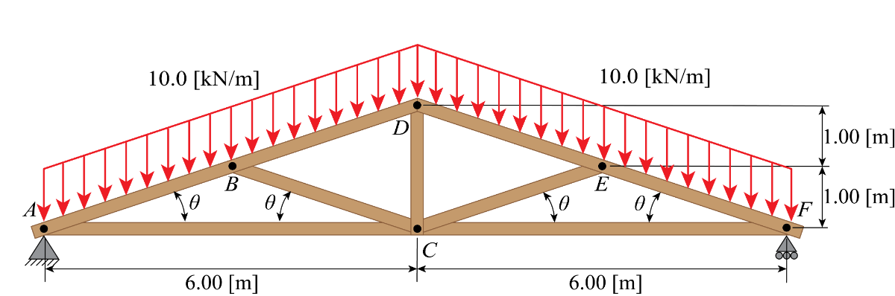

# Chapter 7

## Modeling a Bridge in MATLAB

I introduced the `Symbolic Toolbox` for solving a system of equations in `ch5_plan.md`, so if you are not yet familiar with this technique I recommend that you read through that document.

That is important because we model truss structures as a large system of equations. Take the figure below showing a Queen Post bridge, used in Example $4$ of Chapter $7$ in the TopHat textbook.



There are $6$ total nodes in this truss structure: $\mathrm{A}$, $\mathrm{B}$, $\mathrm{C}$, $\mathrm{D}$, $\mathrm{E}$, and $\mathrm{F}$. We will solve for all of the forces acting within this truss by applying the Method of Joints at each node. And unlike the the TopHat textbook, we will make use of the `Symbolic Toolbox` to cast equations symbolically and solve the system much more simply.

Before solving for any forces, let's quickly determine the value of $\theta$ by analyzing the geometry of the bridge.

$$\theta = \tan^{-1}\left(\displaystyle\frac{1[\mathrm{m}]}{3[\mathrm{m}]}\right) = 18.4349^{\circ}$$

Additionally, we can simplify the distributed loads acting along the top members to be represented by two concentrated loads located at nodes $\mathrm{B}$ and $\mathrm{E}$. We solve for the magnitude of the concentrated load by multiplying the linear load density $10\left[\frac{\mathrm{kN}}{\mathrm{m}}\right]$ with the length over which they act, $L_{\overline{\mathrm{AD}}}$ and $L_{\overline{\mathrm{DF}}}$, respectively.

$$L_{\overline{\mathrm{AD}}} = L_{\overline{\mathrm{DF}}} = \sqrt{6^2 + 2^2} = \sqrt{40} = 6.3246[\mathrm{m}]$$

$$\Vert R\Vert = 10\left[\frac{\mathrm{kN}}{\mathrm{m}}\right] 6.3246[\mathrm{m}] = 63.246[\mathrm{kN}]$$

And for simplicity, we will take the cross-sectional area of all members in the structure to be:

$$A_{\mathrm{xs}} = 10 [\mathrm{cm}]\times 10 [\mathrm{cm}] = 100 [\mathrm{cm}^2]$$

and the bolt diameter to be

$$d_{\mathrm{bolt}} = 0.164 [\mathrm{in}] = 4.1656 [\mathrm{mm}]$$

which leads to the area of the bolt, $A_{\mathrm{bolt}}$, to be found as follows:

$$A_{\mathrm{bolt}} = t_{\mathrm{truss}}d_{\mathrm{bolt}} = (0.1[\mathrm{m}]) (4.1656\times10^{-3} [\mathrm{m}]) = 4.1656\times10^{-4} [\mathrm{m}^2]$$

And finally, we define the yield criteria for this truss.

$$\sigma_{y,\mathrm{T}} = $$

$$\sigma_{y,\mathrm{C}} = $$

$$\tau_{y} = $$

With this information, we can go into MATLAB and define global parameters for the solution:

```MATLAB
% <><><>< GENERAL PARAMETERS ><><><> %

LENGTH = 12;                                  % define the length of the bridge       [m]
HEIGHT = 2;                                   % define the height of the bridge       [m]
AREA_TRUSS = 100 * (10^(-2))^2;               % define the cross-sectional area       [m^2]
BOLT_DIAMETER = 4.1656 * 10^(-3);             % define the bolt diameter              [m]
AREA_BOLT = BOLT_DIAMETER * SQRT(AREA_TRUSS); % define the bolt area                  [m^2]
TENSILE_YIELD = 500 * 10^6;                   % define the tensile yield strength     [Pa]
COMPRESSIVE_YIELD = 300 * 10^6;               % define the compressive yield strength [Pa]
SHEAR_YIELD = 250 * 10^6;                     % define the shear yield strength       [Pa]
THETA = atand(HEIGHT / (LENGTH/2));           % define the angle theta
LOAD = 10 * norm([6,2]);                      % define the load that acts on B and E  [kN]

% <><><>< BRIDGE BROKEN BOOLEANS ><><><> %

TENSILE_FAILUE = false;                       % used to signal a tensile stress failure
COMPRESSIVE_FAILUE = false;                   % used to signal a compressive stress failure
BEARING_FAILURE = false;                      % used to signal a bearing stress failure
```

From here, we can create symbolic variables to represent all of the forces acting throughout the structure. That includes the global reaction forces acting on nodes $\mathrm{A}$ and $\mathrm{F}$, as well as the internal forces within each member. These are laid out as follows:

### Bridge Variables

```MATLAB
% <><><>< Global Reactions ><><><> %
syms R_x_A R_y_A R_y_F

% <><><>< Internal Forces ><><><> %
syms F_AB F_AC F_BC F_BD F_CD F_CE F_CF F_DE F_EF
```

Then we can apply the method of joints at all of the nodes.

**Be sure to follow the proper convention**: *all internal reactionary forces point towards the node in question*.

### Pin A

```MATLAB
% <><><>< Pin A ><><><> %

% ----- Sigma F_x ----- %
F_x_A = R_x_A - F_AB*cosd(THETA) - F_AC == 0;

% ----- Sigma F_y ----- %
F_y_A = R_y_A - F_AB*sind(THETA) == 0;
```

### Pin B

```MATLAB
% <><><>< Pin B ><><><> %

% ----- Sigma F_x ----- %
F_x_B = F_AB*cosd(THETA) - F_BD*cosd(THETA) - F_BC*cosd(THETA) == 0;

% ----- Sigma F_y ----- %
F_y_B = F_AB*sind(THETA) - F_BD*sind(THETA) + F_BC*sind(THETA) - LOAD == 0;
```

### Pin C

```MATLAB
% <><><>< Pin C ><><><> %

% ----- Sigma F_x ----- %
F_x_C = F_AC + F_BC*cosd(THETA) - F_CE*cosd(THETA) - F_CF == 0;

% ----- Sigma F_y ----- %
F_y_C = -F_BC*sind(THETA) - F_CD - F_CE*sind(THETA) == 0;
```

### Pin D

```MATLAB
% <><><>< Pin D ><><><> %

% ----- Sigma F_x ----- %
F_x_D = F_BD*cosd(THETA) - F_DE*cosd(THETA) == 0;

% ----- Sigma F_y ----- %
F_y_D = F_BD*sind(THETA) + F_CD + F_DE*sind(THETA) == 0;
```

### Pin E

```MATLAB
% <><><>< Pin E ><><><> %

% ----- Sigma F_x ----- %
F_x_E = F_DE*cosd(THETA) + F_CE*cosd(THETA) - F_EF*cosd(THETA) == 0;

% ----- Sigma F_y ----- %
F_y_E = -F_DE*sind(THETA) + F_CE*sind(THETA) + F_EF*sind(THETA) - LOAD == 0;
```

### Pin F

```MATLAB
% <><><>< Pin F ><><><> %

% ----- Sigma F_x ----- %
F_x_F = F_EF*cosd(THETA) + F_CF == 0;

% ----- Sigma F_y ----- %
F_y_F = R_y_F - F_EF*sind(THETA) == 0;
```

With both $\displaystyle \Sigma F_{x}$ and $\displaystyle \Sigma F_{y}$ written symbolically for all $6$ nodes, we can compile all $12$ equations and all $12$ variables into vectors to solve with the `Symbolic Toolbox`.

### Compiling and Solving

```MATLAB
% <><><>< COMPILE ><><><> %

eqns = [F_x_A F_x_B F_x_C F_x_D F_x_E F_x_F...
        F_y_A F_y_B F_y_C F_y_D F_y_E F_y_F];
vars = [F_AB F_AC F_BC F_BD F_CD F_CE F_CF F_DE F_EF R_x_A R_y_A R_y_F];
```

Then we can solve the system and extract all of the values from the resultant structure.

```MATLAB
% <><><>< SOLVE ><><><> %

internal_forces = solve(eqns, vars);

F_AB = double(internal_forces.F_AB)
F_AC = double(internal_forces.F_AC)
F_BC = double(internal_forces.F_BC)
F_BD = double(internal_forces.F_BD)
F_CD = double(internal_forces.F_CD)
F_CE = double(internal_forces.F_CE)
F_CF = double(internal_forces.F_CF)
F_DE = double(internal_forces.F_DE)
F_EF = double(internal_forces.F_EF)
R_x_A = double(internal_forces.R_x_A)
R_y_A = double(internal_forces.R_y_A)
R_y_F = double(internal_forces.R_y_F)
```

### Results

This code returns that the internal forces within the bridge are as follows:

| Internal Force | Value $[\mathrm{kN}]$| Tensile / Compressive |
| --- | --- | --- |
| $F_{\overline{\mathrm{AB}}}$ | $200$ | Positive $\longrightarrow$ Tensile |
| $F_{\overline{\mathrm{AC}}}$ | $-189.7367$ | Negative $\longrightarrow$ Compressive |
| $F_{\overline{\mathrm{BC}}}$ | $100$ | Positive $\longrightarrow$ Tensile |
| $F_{\overline{\mathrm{BD}}}$ | $100$ | Positive $\longrightarrow$ Tensile |
| $F_{\overline{\mathrm{CD}}}$ | $-63.2456$ | Negative $\longrightarrow$ Compressive |
| $F_{\overline{\mathrm{CE}}}$ | $100$ | Positive $\longrightarrow$ Tensile |
| $F_{\overline{\mathrm{CF}}}$ | $-189.7367$ | Negative $\longrightarrow$ Compressive |
| $F_{\overline{\mathrm{DE}}}$ | $100$ | Positive $\longrightarrow$ Tensile |
| $F_{\overline{\mathrm{EF}}}$ | $200$ | Positive $\longrightarrow$ Tensile |

And that the reactionary forces at nodes $\mathrm{A}$ and $\mathrm{F}$ are as follows:

| Reactionary Force | Value |
| --- | --- |
| $R_{x,A}$ | $0 [\mathrm{kN}]$ |
| $R_{y,A}$ | $63.2456 [\mathrm{kN}]$ |
| $R_{y,F}$ | $63.2456 [\mathrm{kN}]$ |

### Stresses

What we've done so far is awesome, but it's not quite enough information yet. As engineers, we aren't just interested in knowing the internal forces, we also want to know the stresses within each member.

First, let's store all the forces in a single vector (*hint: you can copy and paste from the `vars` vector we defined earlier because the variable names are the same; just don't include the reactionary forces here!*):

```MATLAB
internal_forces = [F_AB F_AC F_BC F_BD F_CD F_CE F_CF F_DE F_EF];
```

Then the normal stress, $\sigma_{n} = \displaystyle\frac{F}{A_{\mathrm{xs}}}$, and shear stress, $\tau_{n} = \displaystyle\frac{\sigma_{n}}{2}$, are calculated as follows:

```MATLAB
normal_stress = internal_forces ./ AREA_TRUSS;  % can still be positive or negative
shear_stress = abs(normal_stress) ./ 2;         % returns a positive value
```

For comparing the stresses to their respective yield conditions, it is useful to automatically separate the `normal_stress` vector into compressive and tensile stresses. This is done as follows:

```MATLAB
tensile_stress = normal_stress(normal_stress > 0);            % positive normal stress values
compressive_stress = abs(normal_stress(normal_stress < 0));   % negative normal stress values
```

Note: *these two vectors both contain positive values now*

Then we can calculate the bearing stress, $\sigma_{b} = \displaystyle \frac{F}{A_{\mathrm{bolt}}}$, again separating between compressive and tensile bearing stresses.

```MATLAB
bearing_stress = internal_forces ./ AREA_BOLT;
tensile_bearing_stress = bearing_stress(bearing_stress > 0);
compressive_bearing_stress = abs(bearing_stress(bearing_stress < 0));
```

From here, we can query whether any of the internal stress exceed their allowable values.

```MATLAB
TENSILE_FAILUE = any(tensile_stress > TENSILE_YIELD)
COMPRESSIVE_FAILURE = any(compressive_stress > COMPRESSIVE_YIELD)
BEARING_FAILURE = any([tensile_bearing_stress > TENSILE_YIELD, compressive_bearing_stress > COMPRESSIVE_YIELD])
```

## Bridge Optimization

## Torque as Function of Angular Position
