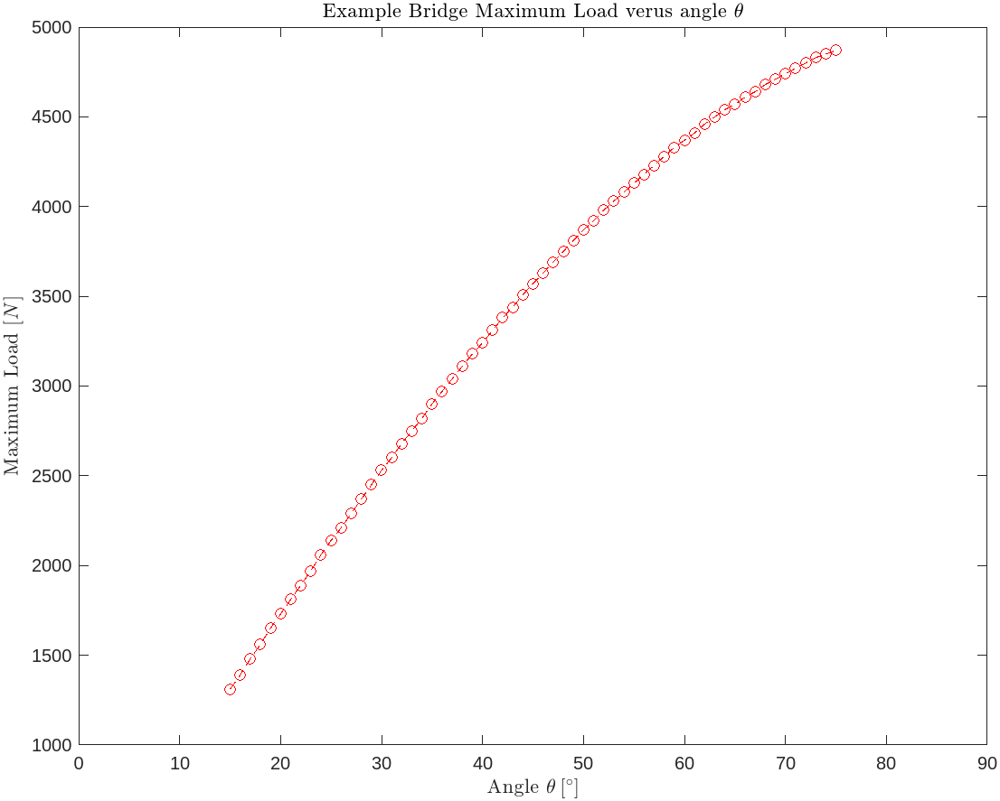

# Chapter 7 (Part 2)

Before diving into how to optimize the bridge, be sure to read through `ch7_model_a_bridge.md` and the associated MATLAB script, `ch7_example_1.m`. This portion of Chapter $7$ builds upon what was covered there in order to introduce the concept of optimizing your bridge designs.

## Bridge Optimization

Previously, I analyzed a Queen Post truss at a single load. But for your project, you are interested in predicting how much weight your bridge can withstand before breaking. We can do this in MATLAB in the same way that a real-life test rig behaves: slowly increase the applied load until the bridge breaks.

Well, slowly increasing a variable until reaching a condition is the *perfect* scenario for implementing a loop! Refer back to `ch5_plan.md` and `ch6_plan.md` for some simple examples of this.

For now, we can write a pseudo-code version just to wrap our heads around what will actually be happening here.

```MATLAB
% [1] define LOAD at some low value to start off with
% [2] apply LOAD to the truss structure at the relevant nodes and solve (part 1 of this chapter's content)
% [3] check whether any stresses in the bridge are too high
% [4] if not, go back to step [2] and increase LOAD a little bit
% [5] if yes, exit the loop
```

Although the whole thing may look intimidating, those individual instructions are pretty simple to implement.

A note before you read this demonstration: *The whole code to solve the bridge is pretty long (`ch7_example_1.m`), so I'm going to pretend that it's a separate function for right now for visual simplicity. It will be treated as some magic box where you input the LOAD and $\theta$ and it tells you all the internal stresses*

```MATLAB
% --------------------------------------------------------------------------- %

% <><><>< GENERAL PARAMETERS ><><><> %

  % List out all global variables from the problem

LENGTH = 12;                                  % define the length of the bridge       [m]
HEIGHT = 2;                                   % define the height of the bridge       [m]
THETA = atand(HEIGHT / (LENGTH/2));           % define the angle theta
TENSILE_YIELD = 19.9 * 10^6;                  % define the tensile yield strength     [Pa]
COMPRESSIVE_YIELD = 12.1 * 10^6;              % define the compressive yield strength [Pa]
SHEAR_YIELD = 5 * 10^6;                       % define the shear yield strength       [Pa]

% <><><>< BRIDGE BROKEN BOOLEANS ><><><> %

  % Initialize these as `false`
  % They will be toggled to `true` if a corresponding stress exceeds its limit

TENSILE_FAILURE = false;                      % used to signal a tensile stress failure
COMPRESSIVE_FAILURE = false;                  % used to signal a compressive stress failure
BEARING_FAILURE = false;                      % used to signal a bearing stress failure
SHEAR_FAILURE = false;                        % used to signal a shear stress failure

% --------------------------------------------------------------------------- %

% [1] define LOAD
LOAD = 10^3;

while ~any([TENSILE_FAILURE, COMPRESSIVE_FAILURE, SHEAR_FAILURE, BEARING_FAILURE])
  % [1, 4] define LOAD, increment it each iteration
  LOAD = LOAD + 100;

  % [2] apply LOAD to the truss
  [tensile_stress, compressive_stress, shear_stress, bearing_stress] = BRIDGE_MODEL(LOAD, THETA);

  % [3] check all the stresses
  TENSILE_FAILURE = any(tensile_stress > TENSILE_YIELD)
  COMPRESSIVE_FAILURE = any(compressive_stress > COMPRESSIVE_YIELD)
  SHEAR_FAILURE = any(shear_stress > SHEAR_YIELD)
  BEARING_FAILURE = any(bearing_stress > COMPRESSIVE_YIELD)
end

% [5] at least one stress was too high, so the `while` loop exited
```

In order to accomplish this, we can make a couple of slight changes to what was covered in Part $1$ to define a function that will solve the bridge, `BRIDGE_MODEL()`, for some input value of $\theta$ and the LOAD. This will be an adaption of `ch7_example_1.m`

```MATLAB
function [tensile_stress, compressive_stress, shear_stress, bearing_stress] = BRIDGE_MODEL(LOAD, THETA)

  % --------------------------------------------------------------------------- %

  % <><><>< GENERAL PARAMETERS ><><><> %

  AREA_TRUSS = 100 * (10^(-2))^2;               % define the cross-sectional area       [m^2]
  BOLT_DIAMETER = 4.1656 * 10^(-3);             % define the bolt diameter              [m]
  AREA_BOLT = BOLT_DIAMETER * sqrt(AREA_TRUSS); % define the bolt area                  [m^2]

  % <><><>< STRESS CALCULATION FUNCTION ><><><> %

  calculate_stress = @(F, A) F ./ A;

  % --------------------------------------------------------------------------- %

  % ----------------------- %
  % SYMBOLIC SYSTEM OF EQNS %   % intentionally not rewritten because it's too big
  % ----------------------- %

  % create a vector to of all 9 internal forces

  internal_forces = [F_AB F_AC F_BC F_BD F_CD F_CE F_CF F_DE F_EF];

  % --------------------------------------------------------------------------- %

  % <><><>< STRESSES ><><><> %

    % calculate the normal (compressive/tensile), shear, and bearing stresses ([Pa])

  normal_stress = calculate_stress(internal_forces, AREA_TRUSS);  % can still be positive or negative
  shear_stress = abs(normal_stress) ./ 2;                         % returns a positive value

  tensile_stress = normal_stress(normal_stress < 0)             % positive normal stress values
  compressive_stress = abs(normal_stress(normal_stress > 0))    % negative normal stress values

  bearing_stress = calculate_stress(abs(internal_forces), AREA_BOLT);

end
```

What we have just accomplished is determining the load that the truss structure, as defined by the angle $\theta$, can withstand. Now we want to optimize the design (optimize the angle $\theta$).

We can do this by placing the entire `while` loop into a `for` loop that iterates over a range of values for $\theta$. This way, we can evaluate the performance of the bridge at every value of $\theta$ and determine the best value based on our definition of best 'performance'. For this project, we are interested in optimizing the performance index, calculated as follows:

$$\mathrm{PI} = \frac{P}{WC}$$

Where $P$ is the load withstood by the bridge, $W$ is the weight of the bridge itself, and $C$ is the cost of the bridge (including material and environmental costs).

We just found a way to get $P$.

$W$ is calculated by taking the density of the material, roughly $\rho = 150\left[\frac{\mathrm{kg}}{\mathrm{m}^3}\right]$, and multiplying by the total volume of wood, calculated with the cross-sectional area $A_{\mathrm{xs}}$ and the total length of wood in the bridge.

We can define the lengths of every member in the bridge as follows:

| Member | Length Formula |
| --- | --- |
| $\mathrm{\overline{AB}}$ | `L_AB = norm([LENGTH//4, HEIGHT/2])` |
| $\mathrm{\overline{AC}}$ | `L_AC = norm([LENGTH//2, 0])` |
| $\mathrm{\overline{BC}}$ | `L_BC = norm([LENGTH//4, HEIGHT/2])` |
| $\mathrm{\overline{BD}}$ | `L_BD = norm([LENGTH//4, HEIGHT/2])` |
| $\mathrm{\overline{CD}}$ | `L_CD = norm([0, HEIGHT])` |
| $\mathrm{\overline{CE}}$ | `L_CE = norm([LENGTH//4, HEIGHT/2])` |
| $\mathrm{\overline{CF}}$ | `L_CF = norm([LENGTH//2, ])` |
| $\mathrm{\overline{DE}}$ | `L_DE = norm([LENGTH//4, HEIGHT/2])` |
| $\mathrm{\overline{EF}}$ | `L_EF = norm([LENGTH//4, HEIGHT/2])` |

And remember that `HEIGHT` is going to change as a function of $\theta$.

```MATLAB
HEIGHT = @(t) tand(t) * LENGTH/2;
```

Therefore, the total length of balsa wood in the bridge is:

$$L_{\mathrm{tot}} = 6\sqrt{\left(\frac{\mathrm{LENGTH}}{4}\right)^2 + \left(\frac{\mathrm{HEIGHT}}{2}\right)^2} + 2\frac{\mathrm{LENGTH}}{2} + \mathrm{HEIGHT}$$

And the volume, $V$, of the wood can be calculated as follows:

$$V_{\mathrm{tot}} = L_{\mathrm{tot}}A_{\mathrm{xs}}$$

Then the total weight of the bridge is calculated, in $[\mathrm{N}]$, as follows:

$$W = \rho L_{\mathrm{tot}}A_{\mathrm{xs}}$$

In MATLAB, these calculations are as follows:

```MATLAB
L_tot = 6*sqrt((LENGTH/4)^2 + (HEIGHT/2)^2) + 2*LENGTH/2 + HEIGHT(THETA);
W = DENSITY * L_tot * AREA_TRUSS * 9.81;
```

And for the sake of simplicity, the costs for each component will be taken from the project document (units may change), despite the fact that physical dimensions are completely different. Please refer to the project document for accurate numbers.

| Part | Cost |
| --- | --- |
| Balsa | 0.0407 [\$/m] |
| Washer | 0.0411 \$/washer |
| Nut | 0.0457 \$/nut |
| Bolt | 0.1564 \$/bolt |

Then we can add these values to our `General Parameters` for the script

```MATLAB
BALSA_CpL = 0.0407;         % Balsa wood cost [$/m]
WASHER_CpU = 0.0411;        % Washer cost [$/unit]
NUT_CpU = 0.0457;           % Nut cost [$/unit]
BOLT_CpU = 0.1564;          % 1.5" Bolt cost [$/unit]

NODE_COUNT = 6;             % Number of nodes
```

And the total cost of the bridge can be calculated as follows:

$$$$

```MATLAB
hardware_cost = sum([WASHER_CpU*(2*NODE_COUNT), ...
                     NUT_CpU*(NODE_COUNT), ...
                     BOLT_CpU*(NODE_COUNT), ...
                     BALSA_CpL*(L_tot)]);
```

Now that we have determined $P$ and solved for both $W$ and $C$, we can solve for the $\mathrm{PI}$.

```MATLAB
PI = LOAD / (W*hardware_cost);
```

Now we are ready to iterate over values of $\theta$ by redefining it as a vector of values:

```MATLAB
THETA = linspace(15, 75); % a range of theta values in degrees
```

Then the entire code above can be evaluated for each value of $\theta$ using a `for` loop, as shown below.

*Note: For visual simplicity, I will represent everything that has already been covered with a comment block. Know that the code is still there, it is just too long to make sense of what I'm actually doing in this step if I include it.*

```MATLAB
% --------------------------------------------------------------------------- %

% <><><>< GENERAL PARAMETERS ><><><> %

% ----- all other parameters omitted for visual clarity ----- %

THETA = linspace(15, 75);     % a range of theta values in degrees
INITIAL_LOAD = 1000;          % [N]

% --------------------------------------------------------------------------- %

% <><><>< SOLVE THE BRIDGE ><><><> %

% Initialize arrays to store results
PI = zeros(length(THETA), 1);
max_load = zeros(length(THETA), 1);

for i = 1:length(THETA)
  theta = THETA(i);
  % [1] define LOAD
  LOAD = INITIAL_LOAD;

  % --------------------------------------------------- %
  % ----- while loop for maximum load calculation ----- %
  % --------------------------------------------------- %

  % Calculate total length, weight, and cost
  L_tot = 6*sqrt((LENGTH/4)^2 + (HEIGHT(theta)/2)^2) + 2*LENGTH/2 + HEIGHT(theta);
  W = DENSITY * L_tot * AREA_TRUSS * 9.81;
  hardware_cost = sum([WASHER_CpU*(2*NODE_COUNT), ...
    NUT_CpU*(NODE_COUNT), ...
    BOLT_CpU*(NODE_COUNT), ...
    BALSA_CpI*(L_tot)]);

  % Store PI and maximum load to plot
  PI(i) = LOAD / (W*hardware_cost);
  max_load(i) = LOAD;

  % reset the initial load for the next iteration of theta
  INITIAL_LOAD = LOAD - 10;

  % reset the failure condition booleans for the next iteration of theta
  TENSILE_FAILURE = false;
  COMPRESSIVE_FAILURE = false;
  SHEAR_FAILURE = false;
  BEARING_FAILURE = false;
end
```

This adaptation to the code is pretty subtle because it's really just wrapping the `while` loop from before inside of a `for` loop. At the end of the `for` loop iteration, it is very important to reset the values for the four `boolean` failure variables to make sure that the next iteration starts fresh. And to save simulation time, it is helpful to reset `INITIAL_LOAD` as well because it is a safe assumption that increasing $\theta$ will increase the maximum allowable load for the structure.

And that's really it! All that's left is plotting and analyzing the results, which are both included at the bottom of the example document, `ch7_example_2.m`. I encourage you to copy my example script and the bridge function, `BRIDGE_MODEL.m`, and then run the example script. You will see printouts with each iteration and then very pretty graphs, as well as printouts regarding the maximum PI and maximum load that the truss is predicted to withstand.




There will be no practice document for this chapter, primarily because the practice is just your project! So enjoy the process and feel free to ask for help whenever needed!
